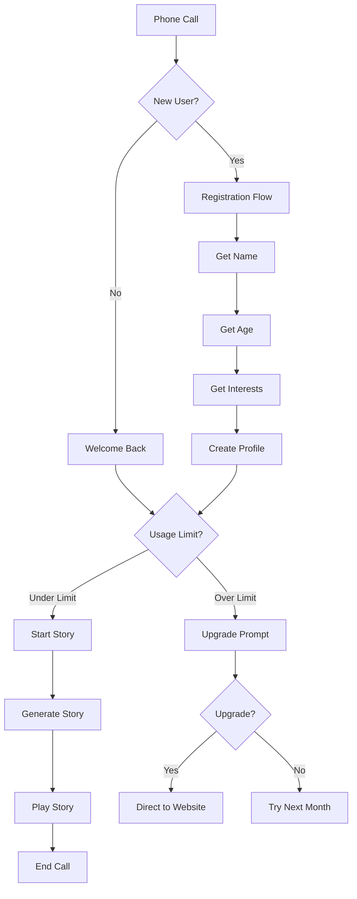

# 📞 StoryLine AI - Phone-Based Bedtime Story Service

> *"Your voice, their dreams, forever preserved"*

Transform bedtime stories through AI-powered phone calls that preserve family voices and create magical, personalized experiences for children while solving the busy parent problem.

[](https://opensource.org/licenses/MIT)
[](https://www.python.org/downloads/)
[](https://flask.palletsprojects.com/)
[](https://www.twilio.com/voice)

## 🌟 What is StoryLine AI?

StoryLine AI is a **phone-first bedtime story service** that combines the nostalgia of childhood phone stories with cutting-edge AI technology. No apps to download, no screens required—just pick up any phone and call for a personalized bedtime story.

### ✨ Key Features

- 📞 **Phone-First**: Works on any phone—smartphones, landlines, even payphones
- 🎭 **Personalized Stories**: AI generates custom tales based on your child's interests
- 🎤 **Voice Preservation**: Record your voice for AI to use in storytelling
- 👥 **Multi-Generational**: Grandparents can participate from anywhere
- 🆓 **Freemium Model**: 3 free stories per month, premium for unlimited access
- 🛡️ **Child-Safe**: COPPA compliant with content moderation

## 🚀 Quick Start

### Prerequisites

- Python 3.8+
- Twilio account with phone number
- ngrok (for local testing)

### Installation

1. **Clone the repository**
```bash
git clone https://github.com/yourusername/storyline-ai.git
cd storyline-ai
```

2. **Install dependencies**
```bash
pip install -r requirements.txt
```

3. **Set up environment variables**
```bash
cp .env.example .env
# Edit .env with your Twilio credentials
```

4. **Run the application**
```bash
python main.py
```

5. **Set up ngrok for testing**
```bash
ngrok http 5000
# Copy the https URL and configure as Twilio webhook
```

### Environment Variables

Create a `.env` file in the project root:

```env
TWILIO_ACCOUNT_SID=your_account_sid_here
TWILIO_AUTH_TOKEN=your_auth_token_here
TWILIO_PHONE_NUMBER=+1234567890
BASE_URL=https://your-domain.ngrok.io
OPENAI_API_KEY=your_openai_key_here  # For future AI features
ELEVENLABS_API_KEY=your_elevenlabs_key_here  # For voice cloning
```

## 🏗️ Architecture

```
┌─────────────────┐    ┌──────────────┐    ┌─────────────────┐
│   Phone Call    │───▶│   Twilio     │───▶│   Flask App     │
│   (Any Device)  │    │   Voice API  │    │   (StoryLine)   │
└─────────────────┘    └──────────────┘    └─────────────────┘
                                                      │
                                                      ▼
┌─────────────────┐    ┌──────────────┐    ┌─────────────────┐
│   Story Audio   │◀───│   Story      │◀───│   SQLite DB     │
│   (Voice TTS)   │    │   Generator  │    │   (User Data)   │
└─────────────────┘    └──────────────┘    └─────────────────┘
```

## 📱 How It Works

### For New Users
1. **Call** the StoryLine AI number
2. **Register** by saying child's name, age, and interests
3. **Listen** to your first personalized bedtime story
4. **Enjoy** 3 free stories per month

### For Returning Users
1. **Call** the same number
2. **Get recognized** automatically by phone number
3. **Choose** from personalized story options
4. **Fall asleep** to magical tales

### For Premium Users
1. **Record** your voice for story narration
2. **Create** custom stories with AI
3. **Share** family voice library across generations
4. **Access** unlimited stories and advanced features

## 🎯 User Experience Flow



## 🔧 Development

### Project Structure

```
STORYLINE-AI/
├── main.py              # Main Flask application
├── requirements.txt     # Python dependencies
├── CLAUDE.md           # Project configuration
├── PRD.md              # Product requirements document
├── README.md           # This file
├── .env.example        # Environment variables template
├── .gitignore          # Git ignore rules
├── tests/              # Test suite
│   ├── test_main.py
│   └── test_stories.py
└── docs/               # Additional documentation
    ├── API.md
    └── DEPLOYMENT.md
```

### Key Components

#### `DatabaseManager`
Handles SQLite operations for user profiles, story sessions, and usage tracking.

#### `StoryGenerator`
Manages story templates and personalization logic. Will integrate with GPT-4 in Phase 2.

#### `Flask Routes`
- `/webhook/voice` - Main call handler
- `/webhook/new_user` - New user registration
- `/webhook/returning_user` - Returning user flow
- `/webhook/start_story` - Story playback

### Running Tests

```bash
pytest tests/
```

### Code Quality

```bash
# Format code
black .

# Lint code
flake8 .
```

## 🎭 Story Templates

Current story templates include:

- **Magic Forest Adventure** - Fantasy exploration with woodland creatures
- **Space Adventure** - Cosmic exploration and discovery
- **Friendly Dragon** - Friendship and magical encounters
- **Underwater Adventure** - Ocean exploration and sea life
- **Superhero Day** - Using powers to help others

Each template adapts to:
- Child's age (vocabulary and complexity)
- Stated interests (animals, magic, space, etc.)
- Story length preferences
- Time of day (calming for bedtime)

## 💰 Monetization

### Freemium Tiers

| Feature | Free | Basic ($9.99) | Premium ($19.99) | Family Legacy ($39.99) |
|---------|------|---------------|------------------|------------------------|
| Stories/Month | 3 | Unlimited | Unlimited | Unlimited |
| Story Types | Pre-recorded | Pre-recorded | AI Generated | AI Generated |
| Voice Options | 1 Narrator | 3 Narrators | Parent Voice | Full Voice Cloning |
| Personalization | Basic | Enhanced | Advanced | Custom Creation |
| Family Sharing | ❌ | ❌ | ✅ | ✅ |

### Revenue Model
- **B2C Subscriptions**: Individual family plans
- **B2B Partnerships**: Hospitals, daycares, pediatric offices
- **Voice Technology Licensing**: API for other family apps
- **Premium Content**: Exclusive stories from children's authors

## 🚀 Roadmap

### Phase 1: MVP (Months 1-3) ✅
- [x] Basic phone integration with Twilio
- [x] User registration and profiles
- [x] Pre-recorded story library
- [x] Freemium usage tracking
- [x] Story personalization engine

### Phase 2: AI Integration (Months 4-6)
- [ ] OpenAI GPT-4 story generation
- [ ] Advanced personalization algorithms
- [ ] Story quality scoring
- [ ] A/B testing framework
- [ ] Premium tier launch

### Phase 3: Voice Technology (Months 7-9)
- [ ] ElevenLabs voice cloning integration
- [ ] Parent voice recording system
- [ ] Multi-voice story narration
- [ ] Family voice library
- [ ] Advanced premium features

### Phase 4: Scale & Enterprise (Months 10-12)
- [ ] Enterprise partnerships
- [ ] International expansion
- [ ] Mobile companion app
- [ ] API for third-party integrations
- [ ] Advanced analytics dashboard

## 🛡️ Security & Privacy

### Child Protection (COPPA Compliant)
- ✅ Minimal data collection
- ✅ Parental consent required
- ✅ Right to deletion
- ✅ No data sharing with third parties
- ✅ Encrypted voice data storage

### Technical Security
- ✅ HTTPS/TLS encryption
- ✅ Input validation and sanitization
- ✅ Rate limiting and abuse prevention
- ✅ Audit logging
- ✅ Secure session management

## 📊 Analytics

### Key Metrics Tracked
- **Monthly Active Families (MAF)**
- **Story completion rates**
- **Average call duration**
- **Premium conversion rates**
- **Voice recording adoption**
- **User satisfaction scores**

### Success Targets (Year 1)
- 🎯 10,000 Monthly Active Families
- 🎯 15% Freemium to Premium conversion
- 🎯 8+ minute average call duration
- 🎯 95% call completion rate
- 🎯 4.8+ star user rating

## 🤝 Contributing

We welcome contributions! Please see our [Contributing Guidelines](CONTRIBUTING.md) for details.

### Development Setup

1. Fork the repository
2. Create a feature branch (`git checkout -b feature/amazing-feature`)
3. Make your changes
4. Add tests for new functionality
5. Ensure all tests pass (`pytest`)
6. Commit your changes (`git commit -m 'Add amazing feature'`)
7. Push to the branch (`git push origin feature/amazing-feature`)
8. Open a Pull Request

## 📝 License

This project is licensed under the MIT License - see the [LICENSE](LICENSE) file for details.

## 🆘 Support

### Documentation
- [API Documentation](docs/API.md)
- [Deployment Guide](docs/DEPLOYMENT.md)
- [Troubleshooting](docs/TROUBLESHOOTING.md)

### Community
- 📧 Email: support@storyline-ai.com
- 💬 Discord: [StoryLine AI Community](https://discord.gg/storyline-ai)
- 📱 Twitter: [@StoryLineAI](https://twitter.com/storylineai)

### Issues
Found a bug? Have a feature request? Please [open an issue](https://github.com/yourusername/storyline-ai/issues).

## 🙏 Acknowledgments

- Inspired by childhood memories of bedtime stories via phone
- Walter AI for voice preservation concept inspiration
- The busy parent community for problem validation
- Open source libraries that make this possible

---

**StoryLine AI** - *Preserving family voices, one bedtime story at a time* 📞✨

---

## 📈 Demo & Testing

### Local Testing with ngrok

1. Start the Flask app: `python main.py`
2. In another terminal: `ngrok http 5000`
3. Copy the ngrok HTTPS URL
4. Configure Twilio webhook: `https://your-id.ngrok.io/webhook/voice`
5. Call your Twilio number to test

### Sample Call Flow

```
Caller: [Dials StoryLine AI number]
AI: "Hi! Welcome to StoryLine AI, where bedtime stories come alive! 
     Is this your first time calling? Press 1 for yes, 2 for no."

Caller: [Presses 1]
AI: "Great! Let's set up your family. What's your child's name? 
     Please say their name clearly after the beep."

Caller: "Emma"
AI: "Nice to meet you, Emma! How old is Emma? 
     Please say their age, like 'five' or 'seven'."

Caller: "Six"
AI: "Perfect! Emma is 6 years old. What does Emma love? 
     Animals, adventures, magic, or something else?"

Caller: "She loves unicorns and magic"
AI: "Perfect! Emma loves unicorns and magic. You have 3 free stories this month. 
     Ready for your first magical story? Press 1 to begin!"

Caller: [Presses 1]
AI: "Here's a special story just for Emma: The Magic Unicorn Adventure.
     Once upon a time, Emma discovered a magical forest where unicorns lived..."
```

This README provides comprehensive documentation for the StoryLine AI project, making it ready for GitHub publication and collaboration.
